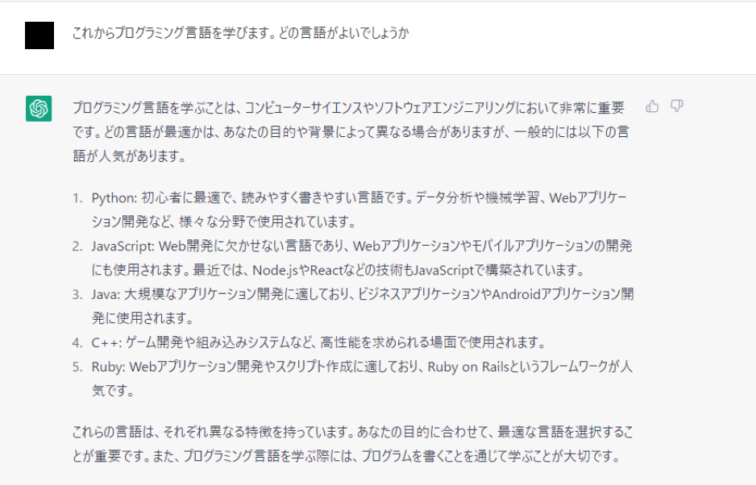

# プログラミングは難しくない！

プログラミングと聞くと、難しそうなイメージがあるかもしれません。でも、実はレゴブロックを組み立てるように、小さなパーツを組み合わせていくだけなんです。

Pythonは、その中でも特に **シンプルで使いやすい** 言語です。  

Pythonは、初心者からプロまで幅広く使われているプログラミング言語で、世界中で最も人気のあるプログラミング言語の1つです。その理由は以下の点にあります。

✅ コードがシンプルで読みやすい
✅ Web開発、AI、データ分析、自動化など幅広い用途に対応
✅ 世界中で利用されるオープンソース言語で、豊富なライブラリが揃っている

「TIOBE Index」は、世界中のプログラミング言語の人気度を示す指標の1つです。

2024年3月のランキングでは、Pythonが1位 にランクイン！
CやJavaといった長年の定番言語を抑え、Pythonの人気が確立されています。
🔗 最新のTIOBE Index: https://www.tiobe.com/tiobe-index/

| 順位 | 言語 |
| --- | --- |
| 1位 | Python |
| 2位 | C |
| 3位 | C++ |
| 4位 | Java |
| 5位 | C# |

# Pythonは現場でも使われている！
Pythonは、単なる学習用の言語ではなく、世界中の企業で実際に使われている 言語です。
実際に、以下のような有名企業がPythonを活用しています。

📌 Google
🔹 PythonはGoogleの検索エンジンやYouTubeの管理システムに使用されています。
🔹 「Pythonの生みの親」Guido van Rossum はGoogleで開発を続けていました。

📌 Meta（Facebook & Instagram）
🔹 InstagramのバックエンドはPythonのフレームワーク Django で開発されています。
🔹 AIによる投稿内容の自動解析やスパム検出にも使われています。

📌 Netflix
🔹 PythonのAI が視聴履歴をもとに「あなたへのおすすめ映画」を自動で選んでいます。
🔹 データ分析 にも活用されており、Pythonが運営の効率化に貢献。

👉 Pythonは「学習しやすい」だけでなく、「実際の仕事で使える」プログラミング言語！

## Web開発

✅ **Webサイトを作る**（SNSやブログのようなアプリ）  

[Django](https://www.djangoproject.com/)や[Flask](https://palletsprojects.com/p/flask/)などのWebフレームワークを使用してWebアプリケーションを構築することができます。

さらにソケットプログラミングのための標準ライブラリがあり、ネットワークプログラミングにも使用されます。

## AI（機械学習/データ分析）
NumPy、Pandas、Matplotlibなどの強力なライブラリがあり、データの取り扱い、分析、可視化を簡単に行うことができます。

また、機械学習や深層学習のためのフレームワークであるTensorFlow、Keras、PyTorchなどが存在し、AI開発に使用されます。

## 画像処理

物体検出とは、画像中に存在する物体の位置と種類を特定するタスクです。

## 画像生成

次の画像の「DCGAN」と呼ばれる手法を用いて、Pythonのプログラムにより手書きの数字を生成しています。

また、Stable Diffusionは、2021年に発表された、より効率的かつ高品質な画像生成手法です。

次の画像は、Stable Diffusionを用いて花の画像を生成したものです。

## 自然言語処理

テキストデータから感情を分析したり、人間のように会話することができます。

### [ChatGPT(GPT)](https://openai.com/blog/chatgpt)

OpenAIが開発した大規模言語モデルの一種で、自然言語処理や対話システムの分野で活躍しています。

ChatGPTは、人工知能による自然言語理解の進歩を象徴する技術の一つとされています。

