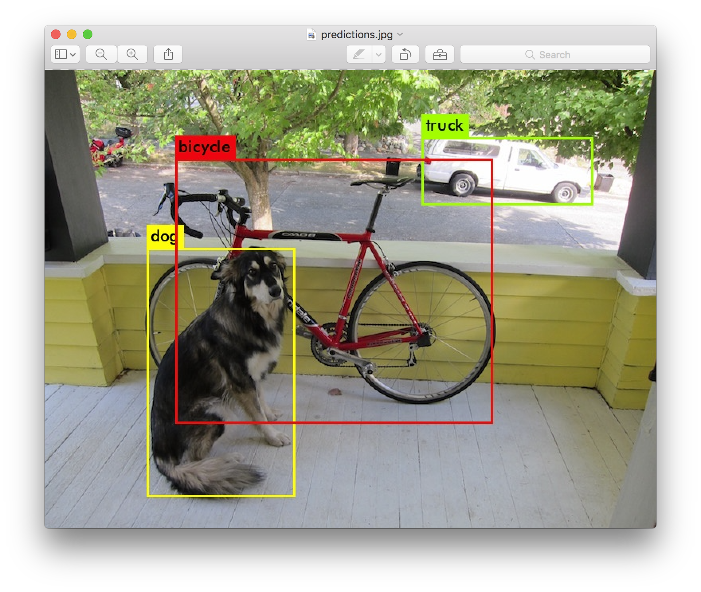

# Pythonでできること

プログラミングと聞くと、難しそうなイメージがあるかもしれません。しかし実際には、小さなパーツを組み合わせていくことで動くものを作れるようになります。

Pythonは、その中でも特に **シンプルで読みやすい** 言語です。初心者からプロまで幅広く使われており、世界で最も人気のあるプログラミング言語の1つです。

- コードがシンプルで読みやすい
- Web開発、AI、データ分析、自動化など幅広い用途に対応
- 豊富なライブラリが揃っているオープンソース言語

Pythonはプログラミング言語の人気ランキングで **世界1位** です（[TIOBE Index 2025](https://www.tiobe.com/tiobe-index/)）。Google、Instagram、Netflixなど多くの企業でも実際に使われています。

## AI・機械学習

機械学習や深層学習のフレームワーク（TensorFlow、PyTorchなど）はPythonで動作し、AI開発の中心的な言語となっています。

## 画像処理

物体検出とは、画像中に存在する物体の位置と種類を特定するタスクです。

## 画像生成

次の画像は「DCGAN」と呼ばれる手法を用いて、Pythonのプログラムにより手書きの数字を生成したものです。

Stable Diffusionは、テキストから高品質な画像を生成できる手法です。

## 実はもう使っている？ ― 身近なAIとPython

皆さんが普段使っている **ChatGPT** や **Gemini** に質問してみたり、AIで **動画や画像を生成** したりした経験はありませんか？

これらのサービスの裏側では、Pythonが中心的な役割を果たしています。ChatGPTの基盤となるモデルの学習にも、AI動画生成の仕組みにも、Pythonが使われています。つまり、皆さんが日常的に触れているAIサービスは、Pythonなしには生まれなかったものばかりです。

## 生成AIの時代にプログラミングを学ぶ意義

最近では、AIに自然言語で指示を出すだけでコードを生成できる「**バイブコーディング**」というスタイルも登場しています。

**では、プログラミングを学ぶ必要はもうないのでしょうか？**

答えは **NO** です。

- AIが生成したコードが **正しいかどうか判断** できるのは、基礎を理解している人だけ
- エラーが出たときに **自分で原因を特定して修正** できる力が必要
- AIへの指示（プロンプト）も、プログラミングの知識がある方が **的確に書ける**

AIはあくまでツールです。使いこなせるかどうかは、土台となる知識があるかどうかで決まります。

この授業では、まずPythonの基礎をしっかり身につけ、最終回でAIを活用したプログラミングを体験します。「基礎があるからこそAIを使いこなせる」ことを実感してもらえるはずです。
