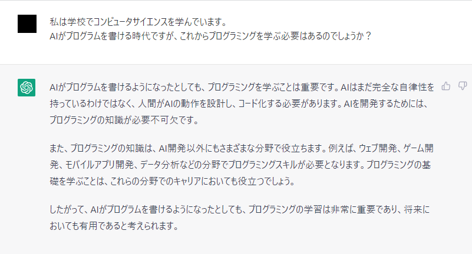

# pythonでできること

## Web開発
DjangoやFlaskなどのWebフレームワークを使用してWebアプリケーションを構築することができます。さらにソケットプログラミングのための標準ライブラリがあり、ネットワークプログラミングに使用されます。

## 機械学習/データ分析
NumPy、Pandas、Matplotlibなどの強力なライブラリがあり、データの取り扱い、分析、可視化を簡単に行うことができます。
また、機械学習や深層学習のためのフレームワークであるTensorFlow、Keras、PyTorchなどが存在し、AI開発に使用されます。

## その他
音声処理、暗号化、テスト自動化、スクレイピングなどの用途にも使用されます。

# 機械学習

機械学習といってもいろいろな分野があります。

- 画像
- 回帰タスク（住宅の価格や株価を予測する等）
- 自然言語

## 画像処理

### 物体検出(YOLO)

### 画像生成

#### [DCGAN](https://www.tensorflow.org/tutorials/generative/dcgan?hl=ja)

https://www.tensorflow.org/tutorials/generative/dcgan?hl=ja

#### [Stable Diffusion](https://www.tensorflow.org/tutorials/generative/generate_images_with_stable_diffusion)

## 自然言語処理

テキストデータから感情を分析したり、人間のように会話することができます。

#### [ChatGPT(GPT)](https://openai.com/blog/chatgpt)

